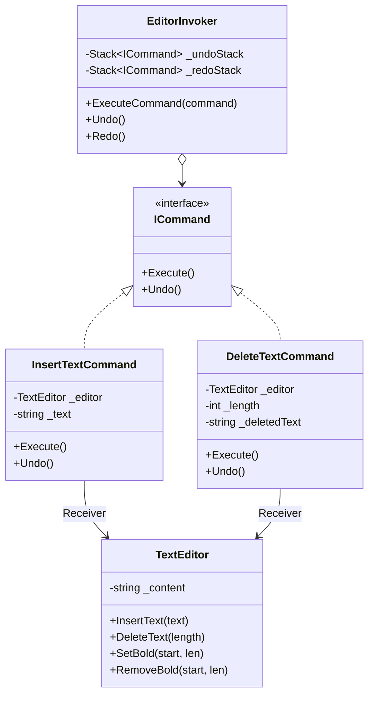

## 🥁 CarnaCode 2026 - Desafio 14 - Command

Oi, eu sou o Ronaldo e este é o espaço onde compartilho minha jornada de aprendizado durante o desafio **CarnaCode 2026**, realizado pelo [balta.io](https://balta.io). 👻

Aqui você vai encontrar projetos, exercícios e códigos que estou desenvolvendo durante o desafio. O objetivo é colocar a mão na massa, testar ideias e registrar minha evolução no mundo da tecnologia.

### Sobre este desafio
No desafio **Command** eu tive que resolver um problema real implementando o **Design Pattern** em questão.
Neste processo eu aprendi:
* ✅ Boas Práticas de Software
* ✅ Código Limpo
* ✅ SOLID
* ✅ Design Patterns (Padrões de Projeto)

## Problema
Um editor de texto precisa implementar operações de desfazer/refazer para múltiplas ações (digitar, deletar, formatar). O código atual chama métodos diretamente, tornando impossível desfazer operações ou implementar histórico de comandos.

## Solução: Padrão Command

O **Command** é um padrão de projeto comportamental que transforma uma solicitação em um objeto independente. Isso permite parametrizar métodos com diferentes solicitações, enfileirar ou registrar solicitações e implementar recursos de operações que podem ser desfeitas.

### Etapas da Refatoração

1.  **Análise do Código Legado (`Challenge.cs`)**: Identificação do acoplamento forte entre `EditorApplication` e `TextEditor`.
2.  **Criação da Interface `ICommand`**: Definição do contrato comum para todos os comandos (`Execute` e `Undo`).
3.  **Implementação de Comandos Concretos**:
    -   `InsertTextCommand`: Encapsula a inserção de texto e sua reversão.
    -   `DeleteTextCommand`: Encapsula a deleção de texto e armazena o estado necessário para restaurá-lo.
    -   `FormatTextCommand`: Encapsula a formatação (negrito).
4.  **Criação do Invoker (`EditorInvoker`)**: Gerencia o histórico de comandos através de pilhas de `Undo` e `Redo`.
5.  **Atualização do Cliente (`Program.cs`)**: Demonstração do uso do padrão, mantendo a classe original `TextEditor` como Receiver.

### Estrutura do Projeto

```
src/
├── Balta.Desafio.Command.csproj  # Projeto .NET 10.0
├── Challenge.cs                  # Código Legado (Receiver)
├── DeleteTextCommand.cs          # Comando Concreto
├── EditorInvoker.cs              # Invoker
├── FormatTextCommand.cs          # Comando Concreto
├── ICommand.cs                   # Interface Command
├── InsertTextCommand.cs          # Comando Concreto
└── Program.cs                    # Ponto de Entrada (Client)
```

### Diagrama de Classes



## Sobre o CarnaCode 2026
O desafio **CarnaCode 2026** consiste em implementar todos os 23 padrões de projeto (Design Patterns) em cenários reais. Durante os 23 desafios desta jornada, os participantes são submetidos ao aprendizado e prática na idetinficação de códigos não escaláveis e na solução de problemas utilizando padrões de mercado.

### eBook - Fundamentos dos Design Patterns
Minha principal fonte de conhecimento durante o desafio foi o eBook gratuito [Fundamentos dos Design Patterns](https://lp.balta.io/ebook-fundamentos-design-patterns).

### Veja meu progresso no desafio
[Repositório central](https://github.com/ronaldofas/balta-desafio-carnacode-2026-central)
